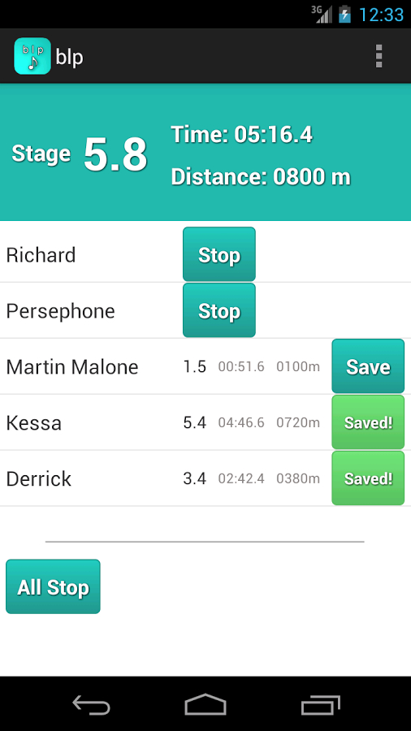
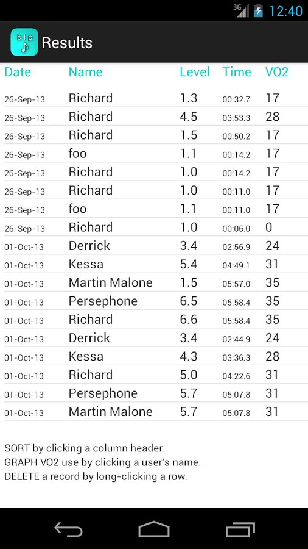
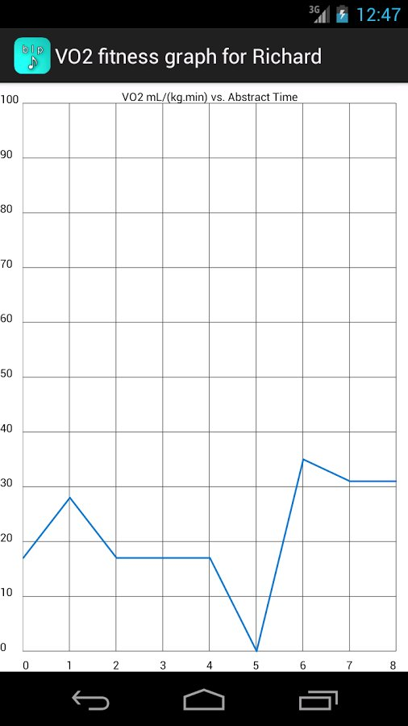

## blp - The bleep test app

The motivation for this project was the lack of fully functional bleep test apps available in the Google Play store at the time. Specifically, I wanted an ad-free, multi-person app that was both functional and didn't cost anything.

Features of the app include: 
* 100% free - no adverts
* Deliberately simple and lightweight
* Up to 5 simultaneous runners
* Calculates VO2-max to quantify a runner's fitness
* Shows a runner's results in graph form to visualise improvement over time

### Requirements

The graphing functionality requires the use of the GraphView library, which isn't included in this repository, but can be found at the following links:

 * http://www.android-graphview.org/
 * https://github.com/appsthatmatter/GraphView-Demos
 
 ### Building
 
 To build requires the use of Android Studio, or equivalent platform. The code has been updated to handle Gradle builds.

### Screenshots

                    
